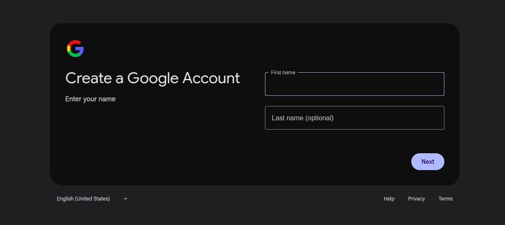

-   [youtube clone](https://www.youtube.com/watch?v=ArmPzvHTcfQ&t=26542s)

-   [start from 7:13:00](https://www.youtube.com/watch?v=ig26iRcMavQ&t=3934s) --- currently on going

# to run the project

1. fill env files
2. install ngork
3. setup prisma
4. integrate mux, uploadthing

# Steps

-   **Installed Next JS, shadcn (no extra tailwind configuration needed)**

---------- login functionality

-   added google
-   skip static files and internals unless found in search params --- copy it from clearMiddleware
-   used catch all route for redirection. Why catch all route is needed?
-   1:40:00 clerk sign in form appears
-   /protected(.\*) ---- protects all the route under protected route
-   login functionality is till 1:50:00
-   login in routes were grouped using (auth) name.
    -   (auth)/sign-in/[[...sign-in]]/page.tsx
    -   (auth)/sign-up/[[...sign-up]]/page.tsx
    -   (auth)/layout.tsx
    -   so far sign in functionality was added using google provider
    -   after sign in/logout user will be redirected to home page
    -   subscription and other pages should be allowed for registered user only ----
    -   on sign out redirect back to home page

**Login Screen**



## Webhook sync

### ngrok setup -- what is ngrok? what purpose does it serve?

ngrok is a **cross-platform application** that creates **secure, stable tunnels** from the public internet to a local machine or a server behind a NAT or firewall.

---

#### 🛠️ Purpose and Function

The primary purpose of ngrok is to **expose a local development server** to the internet. It serves several crucial functions for developers and testing:

-   **Sharing Local Projects:** It allows you to share a website or API running on your local machine with clients, colleagues, or external services **without having to deploy it** to a staging or production server.
-   **Receiving Webhooks:** ngrok is commonly used to test and debug services that rely on **webhooks** (e.g., from platforms like Stripe, Twilio, or GitHub). Since these external services need a public URL to send their HTTP requests, ngrok provides one that forwards the traffic directly to your local application.
-   **Mobile App Development:** It enables mobile applications running on a physical device or emulator to connect to an **API running locally** on your computer.
-   **API and Authentication Testing:** It's essential for testing services that require a publicly accessible callback URL, such as **OAuth 2.0** flows.

##### How it Works

1.  You run the ngrok application on your local machine, specifying the port your local server is running on (e.g., `ngrok http 8080`).
2.  ngrok connects to the ngrok cloud service and reserves a **unique, random public URL** (e.g., `https://abcdef12345.ngrok.io`).
3.  The ngrok cloud service then creates a **secure tunnel** (usually an encrypted TLS/SSL connection) between the public URL and your local ngrok client.
4.  Any request made to the public URL is securely forwarded through the tunnel to your local server, and the response is sent back the same way.

Would you like a step-by-step guide on how to get started using ngrok?

### my web project is running locally. by using ngrok, can I access my project using ngrok? Suppose I run my web project using command -- pnpm dev. then our project runs on a local address. can I run my project anywhere using public url that is provided by ngrok?

Yes, absolutely\! That is the **primary purpose** of ngrok.

Here is a breakdown of how you would use ngrok to access your locally running web project via a public URL:

#### 🔗 Accessing Your Local Project via ngrok

The process you described is exactly what ngrok is designed for.

##### 1\. Find Your Local Port

When you run your project using `pnpm dev`, the output usually tells you the local address and **port** it's running on.

> -   **Example:** If the output says your project is running at `http://localhost:3000` or `http://127.0.0.1:3000`, the port is **3000**.

##### 2\. Start the ngrok Tunnel

Once you know the port (let's assume it's **3000** for this example), you open your terminal and run the ngrok command, telling it to create a tunnel to that port:

```bash
ngrok http 3000
```

##### 3\. Use the Public URL

After a moment, ngrok will display information in your terminal, including the public URLs it has created.

-   **Public URL Example:** `https://abcdef12345.ngrok.io`

Anyone, **anywhere in the world** with an internet connection, can now type that public URL into their browser, and the request will be securely tunneled back to your local machine, where your web project is running on port 3000.

##### Key Points

-   **Live Connection:** Your local project (running with `pnpm dev`) **must remain running** for the ngrok public URL to work.
-   **Security:** ngrok automatically provides an **HTTPS** URL (encrypted connection), which is great for testing and required by most external services.
-   **Sharing:** You can share that `https://...ngrok.io` URL with clients, colleagues, or use it yourself from another device (like your phone or a different computer) to access your project without being on the same Wi-Fi network.

Would you like to know more about how to set up ngrok for a specific kind of web project (like a React app or a Node.js API)?

### Use of a npm package --- concurrently

#### what is the use of npm package concurrently?

The npm package **`concurrently`** is a command-line utility used to **run multiple shell commands or npm scripts simultaneously** (in parallel).

Its main purpose is to simplify the local development workflow by allowing a developer to start all necessary processes with a **single command** from one terminal window, instead of opening multiple tabs.

---

##### 💻 Primary Use Case: Frontend and Backend Development

The most common use case for `concurrently` is in full-stack JavaScript projects (like MERN stack) where you need to run the client (frontend) and the server (backend) at the same time:

1.  **Frontend Watcher/Dev Server:** A command like `npm run client` or `npm run dev` that starts a local development server (e.g., for React, Vue, or Angular) and watches for file changes.
2.  **Backend API Server:** A command like `npm run server` or `nodemon server.js` that starts your API server and potentially restarts it on file changes.

Instead of running these two commands in separate terminal windows, you can combine them into a single script using `concurrently` in your `package.json` file:

```json
{
	"scripts": {
		"client": "npm start --prefix client",
		"server": "nodemon server.js",
		"dev": "concurrently \"npm run client\" \"npm run server\""
	}
}
```

Now, running `npm run dev` executes both the client and server processes concurrently.

---

##### ✨ Key Features and Benefits

-   **Single Terminal Control:** You can start and stop your entire development environment by running a single command (`npm run dev`) and pressing $\text{Ctrl}+\text{C}$ to kill all running processes at once.
-   **Clear Output:** It provides features to color-code the output from different commands and allows you to add custom **prefixes** (e.g., `--names "CLIENT,SERVER"`) to the logs, making it easy to distinguish which process is logging what.
-   **Cross-Platform:** Unlike using shell operators like `&` (which often don't work reliably on Windows), `concurrently` is a cross-platform solution.
-   **Controlling Exit Behavior:** You can use flags like `--kill-others` to automatically terminate all other running processes if one of the monitored commands exits or crashes.

You can learn more about how to set up and run multiple NPM scripts in parallel by watching [Simplify Your Workflow: Running Multiple Scripts using Concurrently](https://www.youtube.com/watch?v=taeqOxI6HQE).

http://googleusercontent.com/youtube_content/0

### use of a npm package --- svix

The npm package for **Svix** is a client library that allows you to easily **send and verify webhooks** within your Node.js application.

The core use of Svix is to provide a **reliable, secure, and scalable Webhook Service** that you can integrate into your own product, saving you from building and maintaining a complex webhook infrastructure yourself.

---

#### 🚀 Key Use Cases for Svix

The Svix service and its corresponding npm package are used for two main roles:

##### 1\. Sending Webhooks (Your Application to Your Users)

If you are building a service that needs to notify your customers (e.g., about a payment event, a database update, or a new shipment), Svix handles the entire outgoing webhook workflow:

-   **Webhook Generation:** You use the Svix npm package to trigger a webhook send from your application's code.
    -   **Example Code Snippet:**
        ```javascript
        await svix.message.create('app-id', {
        	eventType: 'user.created',
        	payload: { user_id: 123, email: 'test@example.com' },
        });
        ```
-   **Reliable Delivery:** Svix takes responsibility for queueing, retrying failed deliveries, and implementing exponential backoff to ensure the webhook eventually reaches your customer's endpoint.
-   **Security (Signing):** It automatically signs the outgoing webhooks using a secret key, ensuring that your customers can verify the payload truly originated from your service.
-   **Monitoring & Dashboards:** It provides a management interface for you and your customers to view the delivery logs, see which webhooks succeeded or failed, and troubleshoot issues.

##### 2\. Receiving and Verifying Webhooks (From External Services)

If your application needs to receive webhooks from a third-party service (like Stripe, GitHub, or Twilio) that uses Svix, you use the package to securely verify the incoming data:

-   **Signature Verification:** The most critical function is the `webhook.verify` utility. It checks the signature attached to the incoming webhook against the known secret key. This step **prevents spoofing attacks** by confirming the webhook was sent by the legitimate third-party service and that the payload hasn't been tampered with.
-   **Payload Parsing:** It helps you safely parse and access the verified JSON payload.

In essence, Svix takes the complexity out of webhook delivery, security, and monitoring, allowing developers to focus on their core application logic.

### How do you create Api route in next js?

suppose the api route is `/test`.

#### Steps:

1. create a `test` folder inside `app` folder
2. inside `test` folder create `route.ts`
3. define a method as following

```js
export const GET = () => {
	return new Response('hello');
};
```

## Chapter 6 | tRPC setup

### What is tRPC? what is the use of this?

tRPC (short for **TypeScript Remote Procedure Call**) is an open-source framework that allows you to **build end-to-end type-safe APIs** without the need for traditional code generation, schema definition languages (like GraphQL's SDL), or runtime validation (like REST with Swagger).

It is not a database, nor is it a transfer protocol like HTTP or gRPC; it's a **developer tool** that simplifies and secures the process of calling functions across the network, specifically between a **TypeScript frontend** and a **TypeScript backend**.

---

#### 💡 How tRPC Works and Its Core Use

The primary purpose of tRPC is to give developers a **seamless, single-language development experience** where API endpoints feel like local function calls.

##### 1\. **Zero-Overhead Type Safety**

This is the most significant use of tRPC.

-   You define your API procedures (functions) and their input/output types **once** on the backend using TypeScript.
-   tRPC automatically infers these types and exposes them to your frontend.
-   When you call a backend procedure from your frontend, TypeScript immediately checks the arguments and the expected return data. If there is a mismatch, the **TypeScript compiler throws an error** during development (compile-time), not a runtime error when the code is running in production.

This eliminates an entire class of bugs and reduces the need for constant context-switching between frontend and backend contracts.

##### 2\. **Defining Procedures (The Backend)**

On the backend (usually Node.js, Express, or Next.js), you define your API endpoints as plain TypeScript functions, using tRPC helpers to enforce input validation (often using Zod).

-   **Example Backend Definition:**
    ```typescript
    // server.ts
    const router = trpc.router().query('getUser', {
    	input: z.object({ id: z.string() }), // Input validation
    	resolve({ input }) {
    		return db.users.findUnique({ where: { id: input.id } });
    	},
    });
    ```

##### 3\. **Consuming Procedures (The Frontend)**

On the frontend (often a React application using the tRPC-React adapter), you call the procedure using a simple, typed hook.

-   **Example Frontend Consumption:**
    ```typescript
    // client.tsx
    // The type of 'data' is automatically inferred as the return type of 'getUser'
    const { data } = trpc.getUser.useQuery({ id: '123' });
    ```

If you tried to call `trpc.getUser.useQuery({ user_id: 123 })` (using `user_id` instead of `id`, and a number instead of a string), **TypeScript would immediately alert you to the error**.

#### 🎯 Benefits of Using tRPC

| Feature                        | Benefit                                                                                                                                                |
| :----------------------------- | :----------------------------------------------------------------------------------------------------------------------------------------------------- |
| **Developer Experience**       | Writing an API feels like writing local functions, which speeds up development.                                                                        |
| **No Build Step/CodeGen**      | Unlike GraphQL, tRPC doesn't require a separate code generation step to synchronize types. It uses TypeScript's native inference.                      |
| **Automatic Input Validation** | Built-in support for Zod (or similar libraries) ensures input is validated _before_ the function logic runs.                                           |
| **Smaller Bundle Size**        | Since you only fetch the procedures you use, client-side bundle size can be smaller compared to using an entire client library for a schema-first API. |

Would you like to know which modern web frameworks (like Next.js or Nuxt) integrate well with tRPC?

### what if don't use trpc? explain with example that will help me understand the difference in code using tRPC and not using tRPC?

If you don't use tRPC, you would typically build your API using a traditional method like **REST** or **GraphQL**. The main consequence of not using tRPC is the **loss of automatic, end-to-end type safety** between your frontend and backend, which introduces friction and potential bugs.

---

#### 🆚 Code Comparison: REST vs. tRPC

Let's look at a simple example: **fetching a user by ID** from a backend API.

##### Scenario: Fetching a User

| Feature                | REST API (No tRPC)                                     | tRPC API                                      |
| :--------------------- | :----------------------------------------------------- | :-------------------------------------------- |
| **Backend Technology** | Express, Koa, or Next.js API Routes                    | Node.js/Next.js with tRPC                     |
| **Frontend Fetching**  | `fetch` or Axios                                       | tRPC Client/React Query Hook                  |
| **Type Safety**        | **Manual** (Requires repeating types on both sides)    | **Automatic** (Types are inferred end-to-end) |
| **Validation**         | Manual input validation (e.g., Joi, Express Validator) | Built-in using Zod or similar library         |

---

#### 1️⃣ Example without tRPC (Traditional REST)

To maintain type safety, you have to manually define the types for the request body/parameters and the response data in **at least three places**.

##### Backend Code (`server.ts`)

The backend defines the endpoint and its logic. The types for `input` and `output` are often implicit or manually enforced.

```typescript
// Define the user data structure
type User = { id: string; name: string; email: string };

// 1. Backend defines the output type (User)
app.get('/api/user/:id', (req, res) => {
	const id = req.params.id; // Type is always 'string'

	// ⛔️ MANUAL CHECK: What if 'id' isn't a valid format?
	if (!id) return res.status(400).send('ID is required');

	const user: User = db.findUser(id); // Assume this returns a User
	return res.json(user);
});
```

##### Frontend Code (`client.tsx`)

The frontend must know the exact endpoint path and manually define the expected response type.

```typescript
// 2. Frontend must manually define the expected type (User)
type User = { id: string; name: string; email: string };

async function fetchUser(userId: string): Promise<User> {
	// 3. The path '/api/user/' must be exactly correct.
	const response = await fetch(`/api/user/${userId}`);

	if (!response.ok) throw new Error('Failed to fetch user');

	// 4. MANUAL ASSERTION: We assume the response structure matches 'User'
	const data = await response.json();
	return data as User;
}
```

**The Danger:** If the backend changes `name` to `fullName`, the frontend code above will still compile but will **fail at runtime** when it receives a different data structure, leading to broken UI.

---

#### 2️⃣ Example with tRPC

With tRPC, you define the procedure once, and the types are automatically shared across the entire stack.

##### Backend Code (`server.ts`)

The backend defines the procedure, and its input and output are strongly typed.

```typescript
// server.ts (The types are inferred and shared)
import { z } from 'zod'; // Used for input validation

const appRouter = trpc.router().query('getUser', {
	// ✅ AUTOMATIC CHECK: Input is strongly typed and validated
	input: z.object({ id: z.string().uuid() }), // Ensures ID is a valid UUID

	resolve({ input }) {
		// The type of 'input' is guaranteed to be { id: string }
		const user = db.findUser(input.id);
		// The return type (e.g., { id: string, name: string }) is inferred
		return user;
	},
});

export type AppRouter = typeof appRouter; // Exports the type definition
```

##### Frontend Code (`client.tsx`)

The frontend imports the router's type and uses the tRPC client. The compiler ensures correctness at every step.

```typescript
// client.tsx
// Assume 'trpc' is initialized with the AppRouter type

function UserComponent() {
	// 1. AUTOMATIC CHECK: If you pass a number, the TS compiler yells at you.
	// 2. AUTOMATIC CHECK: 'data' is immediately typed as the return type of 'getUser'.
	const { data } = trpc.getUser.useQuery({ id: 'valid-uuid-123' });

	return (
		<div>User: {data?.name}</div>
		// 3. AUTOMATIC CHECK: If the backend changes 'name' to 'fullName',
		//    'data?.name' immediately shows a **compile-time error**.
	);
}
```

##### Key Differences Summarized

| Feature             | Traditional REST                                            | tRPC                                                         |
| :------------------ | :---------------------------------------------------------- | :----------------------------------------------------------- |
| **Type Source**     | Duplicated in `.d.ts` files or manually copied.             | **Single Source of Truth** (The backend router definition).  |
| **Error Timing**    | **Runtime Errors** (The application breaks in the browser). | **Compile-Time Errors** (The code won't even build).         |
| **Endpoint Naming** | Must manually keep track of paths like `/api/user/:id`.     | Uses **IntelliSense/autocompletion** (e.g., `trpc.getU...`). |
| **Validation**      | Requires separate middleware.                               | Integrated into the procedure definition.                    |

# React/Next JS things that has been used

1. use suspense
2. react-error-boundary ( a npm package)

## Chapter 7 | tRPC configuration

### use of superjson | npm package

The npm package **Superjson** is a utility library for **serializing and deserializing JavaScript data, including types that are not natively supported by JSON.**

Its main use is to ensure that complex data types remain intact when they are passed between a frontend and a backend, especially in full-stack frameworks where data is transmitted over the network (like a REST API or tRPC).

---

#### 💡 The Problem Superjson Solves

**Standard JSON** (JavaScript Object Notation) is a fantastic data interchange format, but it has limitations. When you call `JSON.stringify()` and then `JSON.parse()`, certain built-in JavaScript types are **silently transformed or lost**:

| Original Type | `JSON.stringify()` Result                                        | Consequence                                                                        |
| :------------ | :--------------------------------------------------------------- | :--------------------------------------------------------------------------------- |
| **`Date`**    | A string (e.g., `"2025-11-29T05:59:28.000Z"`)                    | The receiver gets a **string**, not a `Date` object, requiring manual re-creation. |
| **`Map`**     | An empty object (`{}`)                                           | The Map's data and structure are **completely lost**.                              |
| **`Set`**     | An empty object (`{}`)                                           | The Set's data and structure are **completely lost**.                              |
| **`BigInt`**  | An error is thrown (or it's cast to a number, losing precision). | Cannot reliably transfer very large numbers.                                       |

**Superjson** solves this by intelligently transforming these complex types into a structured JSON object that includes metadata, allowing them to be perfectly reconstructed back into their original type on the receiving end.

---

#### 🛠️ How Superjson is Used

Superjson works by wrapping the standard serialization process. It is most commonly integrated with **tRPC** and **Next.js** because they benefit the most from seamless, type-safe data transfer.

##### 1\. Serialization (On the Sender Side)

When you serialize data, Superjson converts the complex types into a standard JSON structure and includes a special `__superjson` key for metadata.

```javascript
import { serialize } from 'superjson';

const data = {
	createdAt: new Date(),
	ids: new Set([1, 2, 3]),
};

// Result includes metadata to reconstruct the types
const serializedData = serialize(data);
// Example output (simplified): { json: { createdAt: '...', ids: {} }, meta: { dates: ['createdAt'], sets: ['ids'] } }
```

##### 2\. Deserialization (On the Receiver Side)

When you receive the data, Superjson reads the metadata and correctly reconstructs the original JavaScript objects.

```javascript
import { deserialize } from 'superjson';

// The received data
const receivedData = deserialize(serializedData);

// receivedData.createdAt is now a real Date object, not a string
// receivedData.ids is now a real Set object, not an empty object
```

##### Key Benefit: Integration with tRPC

In tRPC, integrating Superjson is often a single configuration step. Once set up, all data passed between the frontend and backend—including query results, mutations, and context—is automatically handled by Superjson, making types like `Date` objects just work without any manual conversion code.

### what is serializing and deserializing? explain with example. show a sample json without serializing and with serializing?

Serializing and deserializing are fundamental concepts in computer science, especially when dealing with data storage and transmission.

---

#### 🔁 What Are Serialization and Deserialization?

##### 1\. Serialization (Encoding)

**Serialization** is the process of translating a **complex data structure** (like an object, array, or class instance in a programming language) into a **format that can be easily stored or transmitted**.

-   **Goal:** To convert an in-memory object (which lives only while the program is running) into a sequence of bytes or a string.
-   **Common Formats:** **JSON** (most common for web), XML, binary formats (like Protocol Buffers or MessagePack).

##### 2\. Deserialization (Decoding)

**Deserialization** is the reverse process: taking the serialized format (the string or sequence of bytes) and reconstructing it back into the original, **in-memory data structure** in the target program.

-   **Goal:** To take a simple transmission format (like a JSON string) and bring it back to a usable object within a program.

#### 🌍 Why Are They Used?

The core uses stem from the limitations of transmitting data structures directly:

-   **Data Transfer (API Calls):** When a web browser sends data to a server, or a server sends data back, complex JavaScript/Python/Java objects must be converted into a universally understood string format (like JSON) to travel over the internet.
-   **Data Storage:** When saving an object to a file, disk, or database, it must be serialized first because the storage medium only understands sequences of bytes.

---

#### 📝 Example: JavaScript Object to JSON

Let's use JavaScript, where the native functions for this process are `JSON.stringify()` (serialization) and `JSON.parse()` (deserialization).

##### 1\. In-Memory JavaScript Object (Before Serialization)

This is the object as it exists in your program's memory. It contains actual JavaScript data types, including a **`Date`** object and a **`Set`** object.

```javascript
const userData = {
	id: 101,
	username: 'user_alpha',
	// A complex type: a Date object
	lastLogin: new Date('2025-11-29T10:00:00.000Z'),
	// A complex type: a Set object
	permissions: new Set(['read', 'write']),
};
```

##### 2\. Serialized Format (Standard JSON)

When you use the standard JSON serialization (`JSON.stringify(userData)`), the complex types are **lost or transformed**:

```json
{
	"id": 101,
	"username": "user_alpha",
	// The Date object is converted to a simple string
	"lastLogin": "2025-11-29T10:00:00.000Z",
	// The Set object is converted to an empty object and its data is lost
	"permissions": {}
}
```

When this is deserialized on the receiving end, `lastLogin` becomes a **string**, not a `Date` object, and `permissions` is an **empty object**, losing the set of values.

##### 3\. Serialized Format (With Superjson)

This is where libraries like **Superjson** (mentioned previously) come in. They add **metadata** to the JSON to preserve complex types.

This is the serialized output **with Superjson**. Note the added `__superjson` object that tells the deserializer how to reconstruct the complex types.

```json
{
	"json": {
		"id": 101,
		"username": "user_alpha",
		"lastLogin": "2025-11-29T10:00:00.000Z",
		"permissions": []
	},
	"meta": {
		"dates": ["lastLogin"],
		"Set": ["permissions"]
	}
}
```

When this is deserialized by Superjson, the receiving program uses the `meta` data to correctly turn the `lastLogin` string back into a **`Date` object** and the `permissions` array back into a **`Set` object**, preserving the original data structure end-to-end.

### what is upstash? what is use of it?

Upstash is a **Serverless Data Platform** designed for developers building modern, real-time, and event-driven applications, especially those using serverless or "Edge" architectures (like AWS Lambda, Vercel Functions, or Cloudflare Workers).

Its main characteristic is that it offers data services, most notably **Redis**, in a **serverless, pay-per-request model** that scales down to zero when not in use.

---

#### 🎯 Core Use and Advantage

The primary use of Upstash is to provide **fast, low-latency data access** to applications running in environments that have traditionally struggled with conventional databases.

##### 1. Serverless Redis (The Main Product)

Upstash's most popular product is its **Serverless Redis**. Redis is a lightning-fast, in-memory data structure store typically used for caching, session management, and real-time operations.

**The Problem It Solves:** Traditional Redis clients use the **TCP protocol**, which requires persistent, long-lived connections. Serverless environments (like AWS Lambda or Edge functions) often spin up and shut down rapidly and are often restricted from making TCP connections, making traditional Redis impractical.

**The Upstash Solution:** Upstash provides an **HTTP/REST API** wrapper around Redis. This allows serverless functions to connect, execute a command, and disconnect immediately over a standard HTTP request, which is much better suited for the serverless model.

##### 2. Eliminating Infrastructure Management

As a serverless platform, Upstash handles all the complexities of infrastructure:

-   **Automatic Scaling:** It automatically scales capacity up and down based on traffic, so developers never have to worry about provisioning or capacity planning.
-   **Scale to Zero:** When your application is idle, your cost scales down to almost zero, as you only pay for the commands (requests) you execute.
-   **Global Low Latency:** It offers multi-region replication, allowing you to store data close to your users globally for the fastest possible response times.

---

#### 🔑 Key Upstash Products and Uses

| Product            | Base Technology         | Primary Use Case                                                                                                                                                           |
| :----------------- | :---------------------- | :------------------------------------------------------------------------------------------------------------------------------------------------------------------------- |
| **Upstash Redis**  | Redis (Key-Value Store) | **Caching** (e.g., website data, API results), **Session Storage**, Leaderboards, Rate Limiting, Counting, and Queues.                                                     |
| **QStash**         | Serverless Messaging    | **Reliable messaging** and scheduling for serverless functions. It ensures message delivery with automatic retries and dead-letter queues, acting as a durable task queue. |
| **Upstash Vector** | Vector Database         | Storing and querying high-dimensional **vector embeddings**. Essential for building modern AI and LLM (Large Language Model) applications.                                 |

In summary, Upstash makes fast, real-time data services accessible, affordable, and easy to use for developers building on the modern **serverless** and **edge computing** stack.

Would you like to see an example of how Upstash Redis is used for rate limiting in a serverless function?

### What is serverless redis?

Serverless Redis is a specialized, modern implementation of the **Redis** key-value store designed to be highly compatible with **serverless and edge computing architectures** (like AWS Lambda, Vercel Functions, or Cloudflare Workers).

It solves the inherent conflicts between traditional Redis architecture and the serverless execution model, allowing developers to use Redis's speed and features without managing persistent infrastructure.

---

#### 🔑 Key Difference: Protocol

The primary difference between standard Redis and Serverless Redis lies in the **network protocol** used for communication:

| Feature                      | Standard (Traditional) Redis                                                                               | Serverless Redis (e.g., Upstash)                                                                               |
| :--------------------------- | :--------------------------------------------------------------------------------------------------------- | :------------------------------------------------------------------------------------------------------------- |
| **Protocol**                 | **TCP** (Transmission Control Protocol)                                                                    | **HTTP/REST** or **TLS-based**                                                                                 |
| **Connection**               | Requires **persistent, long-lived** connections.                                                           | Uses **short-lived connections** (connectionless model).                                                       |
| **Serverless Compatibility** | **Poor**. Serverless functions struggle with persistent TCP connections and often face socket limitations. | **Excellent**. HTTP requests are native to serverless and edge functions, executing quickly and disconnecting. |
| **Cost Model**               | Pay for the **provisioned capacity** (VMs, memory) 24/7.                                                   | Pay-per-**request/command** executed. Scales down to zero cost when idle.                                      |

---

#### 🚀 Why Serverless Redis is Essential

Serverless functions are designed to be **ephemeral**—they spin up rapidly to handle a request and then shut down. This creates problems for traditional databases:

1.  **Connection Management:** If a Lambda function tries to open a new TCP connection to a standard Redis instance for every request, it quickly exhausts the database's connection limit or runs into **latency issues** from connection overhead.
2.  **Stateless Environment:** Serverless functions are generally **stateless**. They are not designed to hold onto a persistent TCP connection to a database.
3.  **Cost:** Paying for a dedicated, always-on Redis instance for an application that only sees traffic for a few hours a day is often cost-prohibitive in the serverless model.

Serverless Redis providers, such as **Upstash**, abstract this complexity by providing an API that routes standard Redis commands over the **HTTP protocol** instead of raw TCP. This allows the serverless function to make a fast, simple web request to execute a command (like `GET` or `SET`) and immediately terminate the connection, aligning perfectly with the ephemeral nature of the serverless environment.

### Why do I need Redis? Can Postgresql replace the need of redis?

You typically need **Redis** because it is an **in-memory data store** optimized for **speed and real-time operations** that a disk-based relational database like PostgreSQL cannot match, especially at scale.

While **PostgreSQL can replace Redis** for some simple caching needs, it generally **cannot fully replace** the need for Redis in high-performance, real-time scenarios due to fundamental architectural differences.

---

#### 🚀 Why You Need Redis (The Speed Difference)

The core reason for using Redis is performance, driven by its architecture:

-   **In-Memory Storage:** Redis stores all data in **RAM** (Random Access Memory). This eliminates the need for slow disk I/O (Input/Output), resulting in **sub-millisecond latency** for read and write operations.
-   **Simple Key-Value Model:** Redis is optimized for very fast lookups by a simple key, avoiding the overhead of parsing complex SQL queries, query planning, and relational joins.
-   **Specialized Data Structures:** Redis supports specialized, highly-optimized data structures (Lists, Sets, Sorted Sets, Hashes) that allow developers to perform complex, real-time operations (like ranking or queuing) with single, ultra-fast commands.

##### Common Redis Use Cases:

| Use Case                   | Why Redis Excels                                                                                                                                        |
| :------------------------- | :------------------------------------------------------------------------------------------------------------------------------------------------------ |
| **High-Speed Caching**     | Stores frequently accessed data (e.g., API responses, HTML snippets) to reduce the load on the PostgreSQL database and deliver results in milliseconds. |
| **Session Management**     | Stores user session data (log-in tokens, shopping carts) where speed and simple key lookups are critical for every request.                             |
| **Rate Limiting**          | Uses atomic increment commands to track user request counts in real-time, preventing service abuse.                                                     |
| **Real-Time Leaderboards** | Uses its **Sorted Set** data structure to maintain and update a ranked list of users instantly.                                                         |
| **Message Queues/Brokers** | Uses its **List** data structure for simple, fast queues and Pub/Sub functionality for real-time notifications.                                         |

---

#### ⚖️ Can PostgreSQL Replace Redis?

PostgreSQL is a powerful, reliable **Relational Database** optimized for data integrity and complex relationships, but its architecture makes it a poor choice for the use cases listed above.

| Feature            | PostgreSQL                                                                        | Redis                                                        |
| :----------------- | :-------------------------------------------------------------------------------- | :----------------------------------------------------------- |
| **Primary Goal**   | **Durability** (ACID compliance) and **Complex Queries** (Joins, Aggregations).   | **Speed** and **Real-Time Operations**.                      |
| **Storage Medium** | Primarily **Disk-based** (though it caches frequently used data in RAM).          | **In-Memory** (RAM).                                         |
| **Data Model**     | **Structured Tables** with enforced schemas and relationships.                    | **Key-Value Store** with specialized data structures.        |
| **Latency**        | **Milliseconds** (slower due to disk I/O, SQL parsing, and transaction overhead). | **Sub-millisecond** (faster due to RAM and simple commands). |

##### When PostgreSQL _Can_ Replace Redis:

For **simple, low-volume caching** where you already use PostgreSQL and want to reduce the operational complexity of managing two separate services, you can use PostgreSQL's features:

1.  **JSONB Data Type:** You can create a simple key-value table and store cached data as a `JSONB` document.
2.  **`UNLOGGED` Tables:** Using `CREATE UNLOGGED TABLE` skips the transactional write-ahead log, which dramatically improves write speed (at the cost of durability—acceptable for cache).
3.  **TTL Emulation:** You can use scheduled jobs (like `pg_cron`) to delete old cache entries, emulating Redis's **Time To Live (TTL)** feature.

##### The Verdict

For core application data, transactional integrity, and complex queries, **PostgreSQL is irreplaceable.**

However, for high-volume caching, rate limiting, and real-time features demanding **sub-millisecond response times**, Redis remains the superior and often **necessary** solution. The two technologies are typically used **together**, with PostgreSQL as the source of truth and Redis as the ultra-fast acceleration layer.

### I'm trying to make a youtube clone and using next js. I want to use standard redis with next js. What will be the pros and cons of using standard Redis with next js?

This is a common architectural decision, as Next.js deployments (especially on platforms like Vercel) often use **serverless functions** for API routes, which fundamentally conflict with the requirements of a **traditional (standard) Redis instance**.

Here are the pros and cons of using a standard, TCP-based Redis with your Next.js application:

---

#### ✅ Pros of Using Standard Redis

| Pro                                     | Explanation                                                                                                                                                                                                                                                                                   |
| :-------------------------------------- | :-------------------------------------------------------------------------------------------------------------------------------------------------------------------------------------------------------------------------------------------------------------------------------------------- |
| **Highest Raw Performance (When Warm)** | A persistent, long-lived **TCP connection** to a standard Redis instance can offer slightly **lower latency** than an HTTP-based serverless Redis solution once the connection is established and warm.                                                                                       |
| **Full Feature Set**                    | Standard Redis offers the full, unconstrained set of features (Pub/Sub, complex lists, cluster management) without any potential limitations or abstraction layers imposed by a serverless provider.                                                                                          |
| **Singleton Connection Control**        | If you **self-host** your Next.js application on a dedicated server or container (not serverless functions), you can create a single, persistent Redis client connection (a singleton pattern) that is shared across all API route executions. This is the ideal use case for standard Redis. |
| **Cost Predictability**                 | If your traffic is high and consistent, paying for a fixed, provisioned Redis instance (e.g., on AWS ElastiCache) may be **more cost-effective** than paying per command execution.                                                                                                           |

---

#### ❌ Cons of Using Standard Redis with Next.js Serverless

The cons largely stem from the **Next.js serverless deployment model** (which is default for platforms like Vercel).

| Con                                      | Explanation                                                                                                                                                                                                                                                                                                                                                                            |
| :--------------------------------------- | :------------------------------------------------------------------------------------------------------------------------------------------------------------------------------------------------------------------------------------------------------------------------------------------------------------------------------------------------------------------------------------- |
| **Connection Limits and Latency**        | **Serverless functions** are ephemeral: they spin up and shut down rapidly. Each invocation may try to create a new TCP connection to Redis. This can lead to: 1. **High Latency:** Connection setup time is slow for every request. 2. **Connection Starvation:** You can quickly **exhaust the connection limit** of your Redis instance during a traffic spike, causing API errors. |
| **Need for a Connection Singleton**      | To combat connection exhaustion, you must write complex code using global variables (`globalThis` or `process.env.NODE_ENV`) to ensure the Redis client connection is established **only once** per serverless container's lifespan (a "singleton"). This adds necessary complexity to your setup.                                                                                     |
| **Cost When Idle (Traditional Hosting)** | If you provision a standard Redis server for your application (e.g., using a cloud VM), you pay for the instance **24/7**, even when your YouTube clone is getting zero traffic.                                                                                                                                                                                                       |
| **Increased Ops Overhead**               | You are responsible for managing, patching, securing, and scaling the Redis cluster itself (or paying a provider for a managed service that may still require capacity planning).                                                                                                                                                                                                      |

#### Summary and Recommendation

For a YouTube clone project using **Next.js deployed to a serverless platform (like Vercel or AWS Lambda):**

1.  **Standard Redis (TCP):** Is _possible_ but highly discouraged due to the **connection limit issues** and complexity of managing singletons in a serverless environment. It works best if you self-host Next.js on a stable server.
2.  **Serverless Redis (e.g., Upstash):** Is the recommended solution. It uses an **HTTP/REST API** wrapper to handle the Redis commands, which is connectionless and perfectly suited for the ephemeral nature of serverless functions, eliminating the connection limit problem entirely.

If you are committed to the standard Redis architecture, you must meticulously implement a **connection singleton** across your Next.js API routes and server components to prevent exceeding connection limits.

To learn more about setting up Redis in a Next.js environment, you might find this video helpful: [Using Serverless Redis with Next.js](https://www.youtube.com/watch?v=FytxaSVQROc).

http://googleusercontent.com/youtube_content/1

### Is there any way to use redis as serverless with next js without using third party api like upstash?

Yes, there is a way to use standard Redis (TCP-based) with Next.js deployed on a serverless platform (like Vercel or AWS Lambda) without relying on HTTP wrappers like Upstash, but it requires careful implementation to avoid connection problems.

The key is to implement a **Connection Singleton** pattern to manage the persistent TCP connections.

---

#### 🛠️ The Solution: The Connection Singleton

The fundamental conflict is that serverless functions are ephemeral, yet standard Redis requires a persistent TCP connection. If every Next.js API route opens a new connection, your Redis server will quickly hit its connection limit.

The solution is to ensure the Redis client object is created **once** per serverless function instance (execution context) and then reused across multiple requests that hit that same instance.

##### 1\. Dedicated Connection Utility File

Create a file (e.g., `lib/redis.ts`) to manage the connection logic. You would use a standard Node.js Redis client like `ioredis` or the official `@redis/client`.

```typescript
// lib/redis.ts (Using ioredis as an example)
import Redis from 'ioredis';

// 1. Extend the global object to hold our cached connection
declare global {
	var redisClient: Redis | undefined;
}

let redis: Redis;

if (process.env.NODE_ENV === 'production') {
	// Production: Create the connection outside the handler logic
	// so it gets reused across multiple function invocations
	redis = new Redis(process.env.REDIS_URL!);
} else {
	// Development: Use the global object to prevent creating
	// multiple connections during Next.js hot-reloading in development
	if (!global.redisClient) {
		global.redisClient = new Redis(process.env.REDIS_URL!);
	}
	redis = global.redisClient;
}

export default redis;
```

##### 2\. Usage in Next.js API Routes

You import the shared client in your API routes and use it directly, knowing that the connection logic handles the reuse.

```typescript
// app/api/cache/route.ts
import redis from '@/lib/redis';
import { NextResponse } from 'next/server';

export async function GET() {
	const cachedData = await redis.get('my-youtube-clone-feed');

	if (cachedData) {
		return NextResponse.json(JSON.parse(cachedData));
	}
	// ... fetch data from PostgreSQL ...
	// ... set new cache data with await redis.set('key', data, 'EX', 3600)
}
```

#### ⚠️ Key Pitfalls and Considerations

This approach successfully mitigates the connection exhaustion problem, but it introduces operational complexities:

1.  **Connection Leaks:** If your client code doesn't properly handle errors and fails to release or reuse the connection (less common with modern clients but still a risk), you will eventually hit connection limits.
2.  **Infrastructure:** You must provision and manage a **dedicated, highly available Redis instance** (e.g., using a cloud provider's managed service like AWS ElastiCache, DigitalOcean Managed Redis, etc.). You must pay for this service 24/7, regardless of traffic.
3.  **High Latency on Cold Start:** When a new serverless function container spins up (a "cold start"), it has to establish the initial TCP connection. This connection time will add several hundred milliseconds of latency to the very first user request that hits that specific instance.
4.  **No Edge Runtime Support:** This TCP-based method **will not work** if you plan to deploy your Next.js API routes or middleware to the **Vercel Edge Runtime** (which uses Cloudflare Workers). The Edge Runtime is severely restricted and only allows connections over HTTP, requiring a third-party wrapper like Upstash.

In summary, while you can avoid a "third-party API" for the Redis command itself, you must use a third-party or managed Redis hosting service, and you must implement the singleton pattern yourself to make it work in a serverless environment.

To see an example of how a standard Redis client works in a Node.js environment, watch this video: [Redis Tutorial for Beginners \#9 - Using Redis with Next.js](https://www.youtube.com/watch?v=JFM-o-csWLs).

http://googleusercontent.com/youtube_content/2

### What is rate limiting in Upstash?

Upstash Rate Limit is a **serverless rate limiting solution** built on top of Upstash's **Serverless Redis**. It allows you to protect your APIs and applications from abuse, overuse, and denial-of-service (DoS) attacks by efficiently tracking and enforcing limits on the number of requests a user, IP address, or API key can make over a given time window.

---

#### 🔑 Key Features and Use

The primary function of the Upstash Rate Limit tool is to provide a **simple, scalable, and cost-effective** way to add rate limiting, especially within serverless and edge environments (where traditional stateful rate limiters are difficult to implement).

##### 1. Simple Implementation

Upstash provides a simple API or a specialized NPM package (like `@upstash/rate-limit`) that allows you to enforce limits with minimal code. You typically specify:

-   **A unique identifier (the key):** What you are limiting (e.g., a user ID, IP address, or token).
-   **The limit:** The maximum number of requests allowed.
-   **The time window:** The duration (e.g., 10 requests per 60 seconds).

##### 2. Built on Redis Commands

At its core, Upstash Rate Limit utilizes the **atomic and fast commands** of Redis, which are perfect for counting and expiring requests in real-time:

-   **Atomic Increments:** It uses commands like `INCR` or `INCRBY` to safely count requests without race conditions.
-   **Time-to-Live (TTL):** It uses the Redis `EXPIRE` command to automatically reset the counter after the time window has passed.

##### 3. Rate Limit Algorithms

Upstash supports the most common and effective rate limiting algorithms:

| Algorithm                      | Description                                                                                                                                         | Best For                                                                                      |
| :----------------------------- | :-------------------------------------------------------------------------------------------------------------------------------------------------- | :-------------------------------------------------------------------------------------------- |
| **Token Bucket**               | Users are allotted tokens that replenish over time. If a request arrives and there are tokens, the request is processed; otherwise, it is rejected. | Controlling burstiness and smoothing traffic.                                                 |
| **Fixed Window**               | A simple counter is set for a fixed time interval. Once the interval is over, the counter resets.                                                   | Simple, easy-to-understand limits. (It can be susceptible to burstiness at the window edges). |
| **Sliding Window Log/Counter** | Tracks request times more precisely across a moving window, providing fairer distribution than Fixed Window.                                        | More robust and widely used for API limiting.                                                 |

#### 🌟 Advantage in Serverless

The major advantage of using Upstash's Rate Limit is its compatibility with **Serverless and Edge Functions**. Since Upstash Serverless Redis allows connections over **HTTP/REST**, your Next.js, Vercel, or Cloudflare worker functions can execute the rate limit check command quickly and disconnect, avoiding the connection exhaustion issues associated with standard TCP-based Redis.

### can I implement rate limiting with out using upstash?

Yes, absolutely. You can implement rate limiting without using a third-party serverless service like Upstash.

The most common and effective way to do this is by using a **standard, self-hosted Redis instance** or by using your **PostgreSQL database**.

Here's a breakdown of the two main alternatives to Upstash:

---

#### 1. Using Standard Redis (Self-Managed) ⚡

If you need the performance of Redis without the Upstash service model, you can provision and manage your own Redis server.

##### How it Works

This approach uses the same core logic as Upstash but relies on a standard TCP connection to your dedicated Redis server:

1.  **Atomic Commands:** You use Redis's **atomic increment** (`INCR`) command to safely count requests for a given key (e.g., the user's IP address or API key).
2.  **Expiration:** You use the **Time-to-Live (`EXPIRE`)** command to automatically delete the key (reset the counter) after the defined window (e.g., 60 seconds) has passed.
3.  **Check and Block:** Before processing a request, your application checks the counter. If the count exceeds the limit, the request is blocked.

##### Key Considerations

-   **Serverless Complexity:** If you are using **Next.js Serverless Functions**, you must carefully implement a **Connection Singleton** pattern to reuse the TCP connection and avoid hitting your Redis server's connection limits.
-   **Cost & Ops:** You are responsible for provisioning, monitoring, and paying for a dedicated Redis server 24/7.

---

#### 2. Using PostgreSQL (Database-Based) 🐢

For applications that are not under extremely high load and where you want to avoid introducing a second data store, you can use your existing PostgreSQL database for rate limiting.

##### How it Works

You create a simple table to track request counts and timestamps. This method is much slower than Redis but is simpler to maintain if you already use Postgres.

1.  **Create a Tracking Table:**

    | Column          | Data Type   | Purpose                                       |
    | :-------------- | :---------- | :-------------------------------------------- |
    | `ip_address`    | `VARCHAR`   | The unique identifier being limited.          |
    | `request_count` | `INTEGER`   | The number of requests in the current window. |
    | `window_start`  | `TIMESTAMP` | When the current limit window began.          |

2.  **The Logic:**
    -   On a new request, your application runs a transaction:
        -   **Check:** See if the `window_start` is still valid and if `request_count` is below the limit.
        -   **Update:** If valid, increment the `request_count`.
        -   **Reset:** If the window has expired, reset `request_count` to 1 and update `window_start`.
        -   **Block:** If the count is over the limit, roll back the transaction and return a 429 status code.

##### Key Considerations

-   **Performance:** This is significantly **slower** than Redis because it involves disk I/O, SQL query parsing, and database transaction overhead. It can introduce noticeable latency for every request and put load on your main database.
-   **Simplicity:** It's the most straightforward method if you are running a low-to-moderate traffic application and want to avoid adding a new component to your infrastructure.

---

#### Choosing the Right Approach

| Method             | Best For                                                                      | Trade-offs                                                                  |
| :----------------- | :---------------------------------------------------------------------------- | :-------------------------------------------------------------------------- |
| **Standard Redis** | High-volume APIs, microservices, and apps requiring sub-millisecond checks.   | High operational overhead, connection management complexity in serverless.  |
| **PostgreSQL**     | Low-to-moderate traffic, applications prioritizing infrastructure simplicity. | Higher latency, increased load on the primary database, slower performance. |

### Implement Rate limit --- upstash branch

-   what is rate limit?

### What was implemented

-   added upstash and implemented redis. Figuring out rate/limit

### What I implemented

-- skipped rate limiter

## Chapter 8 | Video Categories

### Seeding to database

1. create script and prisma model
2. run the script ---- pnpm path/seed-category.ts
3. to run a script, install tsx
4. in package.json --- "seed": "tsx scripts/seed-categories.ts" --- pnpm run seed
5. seed file should import 'dotenv/config';

```ts
import 'dotenv/config';

import prisma from '@/lib/db';

const categoryNames = [
	'Gaming',
	'Music',
	'Vlogs',
	'Comedy',
	'News & Politics',
	'Entertainment',
	'Science & Technology',
	'Education',
	'How-To & Style',
	'Sports',
	'Food & Cooking',
	'Travel & Events',
	'Pets & Animals',
];

async function main() {
	console.log('Seeding categories...');

	try {
		const values = categoryNames.map((name) => ({
			name,
			description: `Videos related to ${name.toLowerCase()}`,
		}));

		await prisma.category.createMany({
			data: values,
			skipDuplicates: true, // ★ prevents unique constraint errors
		});

		console.log('Categories seeded successfully!');
	} catch (err) {
		console.error('Error seeding categories:', err);
		process.exit(1);
	}
}

main();
```

### what does `cn` do in react class name?

The term $\text{cn}$ in a React component's $\text{className}$ prop is typically a shorthand for a **utility function** that intelligently combines and manages CSS class names, often used in projects utilizing **Tailwind CSS**.

---

#### 🛠️ The Purpose of the $\text{cn}$ Function

This $\text{cn}$ function is usually a helper utility that wraps around two very popular libraries:

1.  **$\text{clsx}$**: This library is used for easily constructing class name strings, especially when dealing with **conditional classes** (classes that are only applied if a certain condition is true). It allows you to pass an array of strings, objects, and other values, and it smartly generates a single, clean class name string.

    -   **Example use case:** Applying a class like $\text{text-red-500}$ only if an $\text{isError}$ prop is true.

2.  **$\text{tailwind-merge}$** ($\text{twMerge}$): This library is crucial when working with **Tailwind CSS**. Tailwind's utility classes can sometimes conflict (e.g., applying both $\text{p-4}$ and $\text{p-2}$ for padding). $\text{twMerge}$ resolves these conflicts by ensuring that the **later, more specific, or intended class overrides the former conflicting class**.

    -   **Example use case:** If you pass $\text{cn("bg-red-500", "bg-blue-500")}$, the function will return only $\text{"bg-blue-500"}$, as it correctly overrides the first background color class.

##### How $\text{cn}$ Combines Them

The $\text{cn}$ function combines these two libraries, typically implemented as:

```javascript
import { ClassValue, clsx } from 'clsx';
import { twMerge } from 'tailwind-merge';

export function cn(...inputs: ClassValue[]) {
	return twMerge(clsx(inputs));
}
```

By wrapping $\text{clsx}$ with $\text{twMerge}$, the $\text{cn}$ function provides a simple, readable way to:

-   **Handle dynamic and conditional classes** (via $\text{clsx}$).
-   **Resolve Tailwind CSS conflicts** automatically (via $\text{twMerge}$).
-   **Merge default classes** with classes passed through props (like $\text{className}$).

This utility significantly **simplifies class name management** in component development, making the code cleaner and more maintainable.

You can learn more about creating and using the $\text{cn}$ utility function in this video. [What Is cn() || Use clsx & twMerge With React || shadcn/ui](https://www.youtube.com/watch?v=9Km4oFSmXY8)

http://googleusercontent.com/youtube_content/0

#### is it a good practice to use multiple useEffect in a component in next js? Or there is other ways to avoid this?

It is generally considered a **good practice** to use **multiple $\text{useEffect}$ hooks** in a React (and thus Next.js) component when each hook is responsible for managing a **separate and unrelated side effect**.

---

#### 🟢 Why Multiple $\text{useEffect}$ Hooks is Good Practice

Using multiple hooks helps you keep your code **clean, readable, and maintainable** by following the principle of **separation of concerns**.

1.  **Separation of Concerns (SoC):**

    -   Each $\text{useEffect}$ hook should ideally handle one specific, logical side effect (e.g., fetching data, setting up a subscription, updating the document title, etc.).
    -   Grouping unrelated logic makes the code harder to read and debug. If you mix all effects into one hook, changing the dependency array for one effect could accidentally trigger others.

2.  **Clarity and Readability:**

    -   It's easier for a developer to look at a component and immediately see distinct blocks of logic, each dedicated to a single purpose.
    -   For example, one $\text{useEffect}$ could be for **data fetching** and another for **event listeners**.

3.  **Dependency Management:**

    -   Each hook will have its own, minimal dependency array. This prevents unnecessary re-runs of side effects.
    -   **Bad practice example:** If you combine two effects, you'd have to include the dependencies of _both_ effects in a single array, causing one effect to re-run more often than necessary.

##### Example of Good Practice

```javascript
// Good: Separate effects for separate concerns
function UserProfile({ userId }) {
	const [user, setUser] = useState(null);
	const [posts, setPosts] = useState([]);

	// 1. Effect for fetching user data
	useEffect(() => {
		fetchUser(userId).then(setUser);
	}, [userId]); // Dependency: userId

	// 2. Effect for fetching user posts
	useEffect(() => {
		fetchPosts(userId).then(setPosts);
	}, [userId]); // Dependency: userId

	// 3. Effect for cleaning up resources (e.g., event listener)
	useEffect(() => {
		const handleScroll = () => console.log('Scrolled');
		window.addEventListener('scroll', handleScroll);

		return () => {
			window.removeEventListener('scroll', handleScroll);
		};
	}, []); // Dependency: empty array (runs once)

	// ... rest of component
}
```

---

#### 🚫 When to Avoid Multiple $\text{useEffect}$ (and Alternatives)

While multiple $\text{useEffect}$ hooks are often good, there are scenarios where they can be a sign that you should use other React features or patterns.

| Scenario                  | Alternative Solution                                                          | Why Use the Alternative                                                                                                                                                                                                          |
| :------------------------ | :---------------------------------------------------------------------------- | :------------------------------------------------------------------------------------------------------------------------------------------------------------------------------------------------------------------------------- |
| **Complex State Updates** | Use the **$\text{useReducer}$** hook.                                         | If one state update triggers another state update, the logic can become messy across multiple effects. $\text{useReducer}$ centralizes state logic in a single reducer function, making it easier to manage complex transitions. |
| **State is Derived**      | Calculate the state during the **render phase**.                              | If you have state that can be calculated directly from props or existing state, don't use $\text{useEffect}$ to set it. Just calculate the value directly in the component body.                                                 |
| **Data Fetching Logic**   | Use a dedicated **Data Fetching Library** (e.g., **SWR** or **React Query**). | These libraries simplify fetching, caching, re-fetching, and managing loading/error states, removing the need for boilerplate $\text{useEffect}$ logic for every fetch.                                                          |
| **Reusable Logic**        | Extract logic into a **Custom Hook**.                                         | If you have a set of state and effects that are reused across components (e.g., $\text{useWindowSize}$, $\text{useKeyPress}$), combine the related $\text{useState}$ and $\text{useEffect}$ calls into a single custom hook.     |

##### Summary

The core principle is: **If the side effects are unrelated, use multiple $\text{useEffect}$ calls.** If the logic is intertwined (like complex state transitions) or if you are using $\text{useEffect}$ for a common pattern (like fetching), look to $\text{useReducer}$ or custom hooks instead.

Would you like to see an example of how a custom hook can simplify a component with multiple $\text{useEffect}$ calls?

#### `tailwind` `carousel` argument list and their usage?

check doc

### Points

-   `router.push()` is not the fastest way, we could use `router.prefetch`

## Chapter 9 | Studio Layout

## Chapter 10 | Studio videos

-   see what create button in studio page does.

## Chapter 11 | Infinite Loading

-   `use-intersection-observer.ts` was created. (path => hooks-> use-intersection-observer.ts)
-   infinite loading, load more button is depended on previous chapter suspense

## Chapter 12 | Mux Integration

### How mux uploader will work?

-   modules > videos > server > procedure.ts

it was created in chapter 10

```ts
// 6.49.26
const upload = await mux.video.uploads.create({
	new_asset_settings: {
		passthrough: userId,
		playback_policy: ['public'],
	},
	cors_origin: '*',
});
```

### mux integration steps:

-   **From Chat GPT**

1. create a route to store video information and upload asset id in prisma database
2. hit on route api that you created at step 1 and upload file to mux
3. create a route to update stored information of video with muxPlaybackId, status, thumbnail url if needed

-   **From Tutorial**

1. create a procedure file which upload video and stores video information in prisma. it will also return upload url
2. from `studio-upload-modal.tsx` file create video. pass upload url which is retrieved from step 1 to `StudioUploader.tsx` as endpoint props
3. created new webhook in mux with `public-url-from-ngork/api/videos/webhook`. then copy webhook secret and paste it in .env file
4. created /api/videos/webhook/route.ts, and update database information of mux asset id and mux status, verify signature
5. `StudioUploader.tsx` file should be updated with endpoint

**Mux Integration**

#### Steps that I followed

1. app/(studio)/studio/layout.tsx
2. modules/studio/ui/studio-layout.tsx -> modules/studio/ui/components/studio-navbar/index.tsx -> modules/studio/ui/components/studio-upload-modal.tsx -> /app/api/videos/route.ts (createStudioVideo)
3. /data/videos.ts (inside createStudioVideo()) --- inside this function video saving functionality has been added

## Chapter 13 | Mux Webhooks

-   To define a dynamic update query like

```js
export const updateVideoSchemaOnReady = async ({
	whereField,
	data,
	selectFields,
}: {
	whereField: { key: VideoUniqueField; value: any };
	data: Prisma.VideoUpdateInput;
	selectFields?: Prisma.VideoSelect;
}) => {
	try {
		// Build dynamic where object
		const where: Prisma.VideoWhereUniqueInput = {
			[whereField.key]: whereField.value,
		} as Prisma.VideoWhereUniqueInput;

		const updatedVideo = await prisma.video.update({
			where,
			data,
			select: selectFields,
		});

		return updatedVideo;
	} catch (err) {
		console.log(err);
		throw err;
	}
};
```

follow prisma rules given below -

Yes — **exactly.**
Prisma follows a predictable naming pattern.

---

### ✅ **How Prisma Generates Types**

For any model named:

```
model Video { ... }
```

Prisma automatically generates:

| Purpose                | Type Name                      |
| ---------------------- | ------------------------------ |
| Unique lookup fields   | `Prisma.VideoWhereUniqueInput` |
| Filtering (non-unique) | `Prisma.VideoWhereInput`       |
| Create                 | `Prisma.VideoCreateInput`      |
| Update                 | `Prisma.VideoUpdateInput`      |
| Select                 | `Prisma.VideoSelect`           |
| Include                | `Prisma.VideoInclude`          |

So your assumption is correct.

---

### 📌 For `User` model

If you have:

```
model User {
  id String @id
  email String @unique
  username String @unique
}
```

Then Prisma will generate:

-   `Prisma.UserWhereUniqueInput`
-   `Prisma.UserWhereInput`
-   `Prisma.UserCreateInput`
-   `Prisma.UserUpdateInput`
-   `Prisma.UserSelect`
-   `Prisma.UserInclude`

---

### 🔍 How to Know What Fields Are Unique?

Look at your model:

```prisma
model Video {
  id            String    @id
  muxAssetId    String?   @unique
  muxUploadId   String?   @unique
  muxPlaybackId String?   @unique
  muxTrackId    String?   @unique
}
```

This creates:

```ts
type VideoWhereUniqueInput = {
	id?: string;
	muxAssetId?: string;
	muxUploadId?: string;
	muxPlaybackId?: string;
	muxTrackId?: string;
};
```

So your function correctly derives keys:

```ts
type VideoUniqueField = keyof Prisma.VideoWhereUniqueInput;

// Equivalent to:
// "id" | "muxAssetId" | "muxUploadId" | "muxPlaybackId" | "muxTrackId"
```

---

### 🧩 For ANY other model

##### Example: For `User`

```ts
type UserUniqueField = keyof Prisma.UserWhereUniqueInput;
```

##### Example: For `Category`

```ts
type CategoryUniqueField = keyof Prisma.CategoryWhereUniqueInput;
```

---

### 🧠 **General Rule (easy to remember)**

If your model is named:

```
model X { ... }
```

Your Prisma types will always be:

```
Prisma.XWhereUniqueInput
Prisma.XWhereInput
Prisma.XCreateInput
Prisma.XUpdateInput
Prisma.XSelect
```

---

### 👉 Want me to generate a **generic update function** that works for ANY Prisma model with full type safety?

Example:

```ts
await updateByUnique('video', 'id', '123', { status: 'ready' });
await updateByUnique('user', 'email', 'test@test.com', { name: 'Shaun' });
```

Just say **“yes make it generic”**.

## Chapter 14 | Video Form

got userId from user, id from input. get video from videos schema videos.id == id and videos.userId

### will suspense work here according to next js 16?

```jsx
import { VideoView } from '@/modules/studio/ui/view/video-view';
import { Suspense } from 'react';

export const dynamic = 'force-dynamic';

interface PageProps {
	params: Promise<{ videoId: string }>;
}

const page = async ({ params }: PageProps) => {
	const { videoId } = await params;
	return (
		<div>
			<Suspense fallback={<p>Loading in suspense....</p>}>
				<VideoView videoId={videoId} />
			</Suspense>
		</div>
	);
};

export default page;

import { FormSection } from '../sections/form-section';

interface PageProps {
	videoId: string;
}

export const VideoView = ({ videoId }: PageProps) => {
	return (
		<div className="px-4 pt-2.5 max-w-5xl">
			<FormSection videoId={videoId} />
		</div>
	);
};

('use client');

import { SingleVideoType } from '@/types';
import { useEffect, useState } from 'react';

interface FormSectionProps {
	videoId: string;
}

export const FormSection = ({ videoId }: FormSectionProps) => {
	const [singleVideo, setSingleVideo] = (useState < SingleVideoType) | (undefined > undefined);

	const getVideoByIDFunc = async () => {
		try {
			const res = await fetch(`/api/video?id=${videoId}`, {
				method: 'GET',
			});

			const result = await res.json();

			setSingleVideo(result);
		} catch (err) {
			console.log(err);
		}
	};

	useEffect(() => {
		getVideoByIDFunc();
	}, []);

	return <>{JSON.stringify(singleVideo)}</>;
};
```

---

This is a very insightful question about how Suspense interacts with Client Components and data fetching in the Next.js App Router (which uses React 18, and Next.js 14, not 16, as of the current major stable version).

The short answer is: **No, the `<Suspense>` boundary will not work as intended for the `FormSection` component's data fetching in this exact setup.**

Here is a breakdown of why, and how you need to modify the code for Suspense to be effective.

---

#### 1\. Why Suspense Won't Work Here

The `<Suspense>` component works by catching a Promise that is **thrown** during the rendering process of a component below it.

In your current structure:

1.  **`page.tsx` (Server Component):** Renders the `<Suspense>` boundary and the `<VideoView />`. This part is correct.
2.  **`VideoView.tsx` (Server Component):** Renders the `<FormSection />`. This is also correct.
3.  **`FormSection.tsx` (Client Component):**
    -   It renders **immediately** on the client.
    -   The data fetching (`getVideoByIDFunc`) is triggered inside the `useEffect` hook.
    -   The `useEffect` hook runs **after** the initial render and component hydration.
    -   **Crucially, the `useEffect` hook cannot throw a Promise that React can catch.** It's outside the main render cycle.
    -   Therefore, the `<Suspense fallback>` is immediately replaced by the client component, which then enters a loading state (`useState`) _internally_ while the fetch occurs.

Your application flow will be: **Server Render $\rightarrow$ Fallback shown briefly (for network delay) $\rightarrow$ Client takes over and shows `FormSection`'s initial content (e.g., `null` or empty state) $\rightarrow$ `useEffect` runs $\rightarrow$ Data loads $\rightarrow$ `FormSection` updates.**

The fallback text `"Loading in suspense...."` will likely _not_ be visible while the API call is in progress.

#### 2\. The Solution: Move Data Fetching to the Server

The idiomatic way to use Suspense in Next.js App Router is to move the asynchronous data fetching into a **Server Component** and let React automatically handle the Suspense boundary.

##### **Step 1: Modify `VideoView` to Fetch Data (Server Component)**

Make the `VideoView` component `async` and perform the fetch there. Since it runs on the server, you can directly hit your API handler or, better yet, call a server-side data access function (like a Prisma query).

**`/modules/studio/ui/view/video-view.tsx` (New, Simplified, Async)**

```tsx
import { FormSection } from '../sections/form-section';

interface VideoViewProps {
	videoId: string;
}

// 1. Make the Server Component async
export const VideoView = async ({ videoId }: VideoViewProps) => {
	// 2. Fetch data directly on the server (e.g., call a service or Prisma function)
	// NOTE: This is a placeholder; you'd replace this with a direct database query.
	const res = await fetch(`http://localhost:3000/api/video?id=${videoId}`, {
		method: 'GET',
		// Optional: Ensure this server fetch is dynamic
		cache: 'no-store',
	});

	if (!res.ok) {
		throw new Error('Failed to fetch video data on server.');
	}

	const singleVideo = await res.json();

	// 3. Pass the fetched data down as props
	return (
		<div className="px-4 pt-2.5 max-w-5xl">
			{/* FormSection is now responsible ONLY for UI/Interactivity */}
			<FormSection videoId={videoId} initialVideoData={singleVideo} />
		</div>
	);
};
```

##### **Step 2: Modify `FormSection` (Client Component)**

Remove the `useEffect` and `useState` for data fetching. It now receives the data as a prop and initializes its internal state (if needed for editing) or simply renders the data.

**`/modules/studio/ui/view/sections/form-section.tsx` (Simplified Client Component)**

```typescript
'use client';

import { SingleVideoType } from '@/types';
import { useState } from 'react';

interface FormSectionProps {
	videoId: string;
	// 1. New prop for data passed from the server
	initialVideoData: SingleVideoType;
}

export const FormSection = ({ videoId, initialVideoData }: FormSectionProps) => {
	// 2. Initialize state with the server-fetched data (good for forms/editing)
	const [videoData, setVideoData] = useState<SingleVideoType>(initialVideoData);

	// NOTE: useEffect for fetching is now GONE!

	return (
		<div className="border p-4">
			<h2>Video ID: {videoId}</h2>
			<h3>Data Loaded via Server Suspense</h3>
			<pre>{JSON.stringify(videoData, null, 2)}</pre>
			{/* Add your form inputs here, using videoData */}
		</div>
	);
};
```

##### **Step 3: The `page.tsx` Remains the Same (It Works Now\!)**

Since `VideoView` is now an `async` Server Component, when the Next.js/React runtime hits `await VideoView(...)`, it pauses the rendering of the parent and _throws a Promise_ while the server-side fetch is running. This Promise is caught by the `<Suspense>` boundary, which then displays the fallback:

**`page.tsx` (No Changes Needed)**

```tsx
import { VideoView } from '@/modules/studio/ui/view/video-view';
import { Suspense } from 'react';

// ... other code ...

const page = async ({ params }: PageProps) => {
	const { videoId } = await params;
	return (
		<div>
			{/* THIS SUSPENSE NOW CATCHES THE PROMISE THROWN BY THE ASYNC VideoView */}
			<Suspense fallback={<p>Loading in suspense....</p>}>
				<VideoView videoId={videoId} />
			</Suspense>
		</div>
	);
};

export default page;
```

### If I try to make FormSection component async, it throws an error of <FormSection> is an async Client Component. Only Server Components can be async at the moment. This error is often caused by accidentally adding `'use client'` to a module that was originally written for the server.

That's a very common and expected error\!

The error you are seeing when you try to make your `FormSection` component `async` is likely one of the following, depending on the full environment:

1.  **"Async component is not allowed in Client Components"** (or similar wording).
2.  **"Functions that are passed as props to Client Components cannot be async"**.

#### **The Core Problem**

The fundamental rule in the Next.js App Router and modern React architecture is:

**You cannot use the `async/await` syntax within a Client Component.**

Client Components are marked by the `'use client'` directive. They are expected to be regular React functions that run in the browser. The `async` keyword is reserved for **Server Components** (components without the `'use client'` directive) where Next.js/React can stream and render their output before the client-side JavaScript bundle loads.

Since your `FormSection` component is clearly marked:

```typescript
'use client';
// ...
export const FormSection = ({ videoId }: FormSectionProps) => { // NOT async
```

You must keep it a regular, synchronous function.

---

#### **The Solution Recap (The Correct Way to Use Suspense)**

As detailed in the previous response, the correct approach is to keep the data fetching logic **out** of the client component's initial render cycle and place it into a parent **Server Component** that can be `async`.

##### **Current (Broken) Flow:**

1.  **Server Component (`VideoView`)** renders.
2.  It passes props to **Client Component (`FormSection`)**.
3.  `FormSection` mounts in the browser.
4.  `useEffect` runs _after_ rendering and starts fetching.
5.  **Suspense does not catch this fetch.**

##### **Correct (Suspense-Enabled) Flow:**

1.  **Server Component (`VideoView`)** is made `async`.
2.  `VideoView` executes the `await fetch(...)` **on the server**.
3.  While the fetch is pending, the parent `<Suspense>` boundary displays the fallback.
4.  Once data is ready, `VideoView` resumes and passes the **data** as a prop to `FormSection`.
5.  **Client Component (`FormSection`)** renders immediately with the data, eliminating the need for `useState` and `useEffect` for the initial fetch.

#### **Actionable Steps to Fix Your Code**

1.  **Remove `useState` and `useEffect` from `FormSection`.**
2.  **Modify `VideoView` to be `async`** and fetch the `singleVideo` data.
3.  **Pass the fetched data into `FormSection`** as a prop (`initialVideoData`).

This makes your application structure align with the best practices for the Next.js App Router and React Suspense.

### what change should I make in video-view.tsx file so that component renders suspense fallback always

There should be a delay in `video-view.tsx` file. This file returns a promise. If the promise is successful server components renders successfully. If there is any delay in the promise, server component will fall back to suspense during the time of delay.

in `video-view.tsx`, add

```jsx
const delay = (ms: number) => {
	return new Promise((resolve) => setTimeout(resolve, ms));
};

export const VideoView = async ({ videoId }: VideoViewProps) => {
	await delay(3000); // wait for 3 second

	//....
};
```

### what zod resolver does with resolver of react hook form?

This is a great question about using the Zod library with React Hook Form\!

The **Zod Resolver** acts as a crucial bridge between **React Hook Form (RHF)** and the **Zod schema validation library**.

Here is a breakdown of what the Zod Resolver does with the resolver function of React Hook Form:

#### ⚙️ The Role of the Resolver in React Hook Form

React Hook Form requires a `resolver` function as an optional parameter to integrate external validation libraries.

-   The RHF library expects this `resolver` function to take the form data as input and return an object with either validation `values` (if successful) or validation `errors` (if unsuccessful).
-   **Without a resolver**, RHF relies on its built-in, individual field validation (using the `rules` parameter in `register`).

#### 🤝 What the Zod Resolver Does

The Zod Resolver is a package (usually `@hookform/resolvers/zod`) that takes your Zod schema and transforms it into the specific format that React Hook Form's `resolver` function expects.

Here are its key functions:

1.  **Translates the Zod Schema:**

    -   You define your form's data structure and validation rules using **Zod** (e.g., `z.object({ email: z.string().email(), password: z.string().min(8) })`).
    -   The Zod Resolver takes this schema and wraps it in a function that RHF can execute.

2.  **Performs the Validation:**

    -   When RHF triggers validation (on submit, change, or blur, based on your RHF mode), it calls the `resolver` function provided to `useForm`.
    -   The Zod Resolver then runs the incoming form data against your original **Zod schema** using Zod's powerful validation engine.

3.  **Formats the Output for RHF:**

    -   **Success:** If the Zod validation passes, the Zod Resolver returns an object with the successfully parsed data in the RHF-expected format: `{ values: validatedData, errors: {} }`.
    -   **Failure:** If the Zod validation fails, Zod throws a detailed error. The Zod Resolver catches this error and transforms the complex Zod validation error object into the simple `{ errors: { fieldName: { message: '...' } } }` structure that RHF needs to display error messages on the form fields.

#### 📝 Example of Implementation

You pass the result of the Zod Resolver directly into the `useForm` hook:

```javascript
import { useForm } from 'react-hook-form';
import { zodResolver } from '@hookform/resolvers/zod';
import * as z from 'zod';

// 1. Define the Zod Schema
const loginSchema = z.object({
	email: z.string().email('Invalid email address'),
	password: z.string().min(6, 'Password must be at least 6 characters'),
});

// 2. Use the Zod Resolver in useForm
const {
	register,
	handleSubmit,
	formState: { errors },
} = useForm({
	// This is where the Zod Resolver does its work:
	resolver: zodResolver(loginSchema),
	// Optional: Set default values based on the schema's type
	defaultValues: {
		email: '',
		password: '',
	},
});

// ... rest of the form component
```

#### 🔑 In Summary

| Feature     | React Hook Form's `resolver`                                                            | Zod Resolver (`@hookform/resolvers/zod`)                                                     |
| :---------- | :-------------------------------------------------------------------------------------- | :------------------------------------------------------------------------------------------- |
| **Purpose** | A required interface for external validation libraries to connect and report results.   | The specific package that translates a Zod schema into the RHF-compatible resolver function. |
| **Input**   | The raw form data.                                                                      | The Zod schema object.                                                                       |
| **Output**  | An object like `{ values: data, errors: {} }` or `{ values: {}, errors: errorObject }`. | A function that produces the required RHF output after running data against the Zod schema.  |

Would you like to see a comparison of the benefits of using the Zod Resolver versus RHF's built-in validation?

```jsx
<Form {...form}>
	<form onSubmit={form.handleSubmit(onSubmit)}>
		<div className="flex items-center justify-between mb-6">
			<div>
				<h1 className="text-2xl font-bold">Video Details</h1>
				<p className="text-xs text-muted-foreground">Manage your video details</p>
			</div>

			<div className="flex items-center gap-x-2">
				<Button type="submit" disabled={false}>
					Save
				</Button>
				<DropdownMenu>
					<DropdownMenuTrigger asChild>
						<Button variant="ghost" size="icon">
							<MoreVerticalIcon />
						</Button>
					</DropdownMenuTrigger>
					<DropdownMenuContent align="end">
						<DropdownMenuItem>
							<TrashIcon className="size-4 mr-2" />
							Delete
						</DropdownMenuItem>
					</DropdownMenuContent>
				</DropdownMenu>
			</div>
		</div>
		<div className="grid grid-cols-1 lg:grid-cols-5 gap-6">
			<div className="space-y-8 lg:col-span-3">
				<FormField
					control={form.control}
					name="name"
					render={({ field }) => (
						<FormItem>
							<FormLabel>
								Title
								{/* TODO: add AI generate button */}
							</FormLabel>
							<FormControl>
								<Input {...field} placeholder="Add a title to your video" />
							</FormControl>
							<FormMessage />
						</FormItem>
					)}
				/>
				<FormField
					control={form.control}
					name="description"
					render={({ field }) => (
						<FormItem>
							<FormLabel>Description</FormLabel>
							<FormControl>
								<Textarea
									{...field}
									value={field.value ?? ''}
									rows={10}
									className="resize-none pr-10"
									placeholder="Add a title to your video"
								/>
							</FormControl>
							<FormMessage />
						</FormItem>
					)}
				/>
			</div>
		</div>
	</form>
</Form>
```

## Chapter 15 | Video Thumbnail

-   Integrate UploadThing

1. this auth() should return a userId, which should match db/logged in userID
2. /update videos with thumbnailUrl -> file.url, where video.id, metadata.videoId is equal and videos.userId, metadata.userId is equal
3. aa

## Chapter 16 | AI Background Job

"AI Background Jobs" refers to tasks that use Artificial Intelligence or Machine Learning (ML) models to perform intensive, long-running, or scheduled work without requiring immediate user interaction.

The main purpose is to offload heavy computational work and process large volumes of data asynchronously, leading to better user experience, higher efficiency, and automated insights.

## Chapter 17 | AI Thumbnails

## Chapter 18 | Video Page

-   [start from 1:28:00](https://www.youtube.com/watch?v=ig26iRcMavQ&t=3934s) --- currently on going

-   learn how to create custom component, /youtube-clone/modules/users/ui/components/userInfo.tsx -- this is a custom component
-   use of `useMemo` in `video-top-row.tsx`

## Chapter 19 | Video View

## Chapter 20 | Video Reaction

-   when to use ENUM in database?

## Chapter 21 | Subscriptions

### How would I setup a subscription schema?

To set up a subscription schema (often called a "Self-relation" or "Follower" system), you need to define two distinct relationships back to the `User` model: one for the **Subscriber** (viewer) and one for the **Subscribed-to** (creator).

In Prisma, when you have two relations pointing to the same model, you **must** use relation names to disambiguate them.

#### 1. Updated `Subscription` Model

Change your `subscriptions` model to this structure:

```prisma
model Subscription {
    id        String   @id @default(cuid())
    viewerId  String   // The person following
    creatorId String   // The person being followed
    createdAt DateTime @default(now())
    updatedAt DateTime @updatedAt

    // We name the relations so Prisma knows which is which
    viewer  User @relation("UserSubscribing", fields: [viewerId], references: [id], onDelete: Cascade)
    creator User @relation("UserBeingSubscribedTo", fields: [creatorId], references: [id], onDelete: Cascade)

    @@unique([viewerId, creatorId]) // Prevents a user from subscribing to the same creator twice
    @@index([viewerId])
    @@index([creatorId])
    @@map("subscriptions")
}

```

#### 2. Updated `User` Model

You must also update the `User` model to include the "opposite" side of these relations. This allows you to easily query a user's subscribers or the people they follow.

```prisma
model User {
  id            String    @id @default(cuid())
  // ... your other fields (name, email, etc.)

  videos        Video[]
  videoViews    videoViews[]
  reactionType  videoReactions[]

  // NEW: Relationships for subscriptions
  // People who have subscribed to THIS user
  subscribers   Subscription[] @relation("UserBeingSubscribedTo")

  // People THIS user has subscribed to
  following     Subscription[] @relation("UserSubscribing")

  @@map("users")
}

```

---

#### Key Improvements Made:

-   **Relation Names:** By using `"UserSubscribing"` and `"UserBeingSubscribedTo"`, Prisma understands that these are two different logical paths connecting the same two tables.
-   **Unique Constraint:** The `@@unique([viewerId, creatorId])` is critical. It ensures that the database prevents "duplicate" subscriptions (e.g., a user clicking "Subscribe" twice shouldn't create two rows).
-   **Indexing:** Added `@@index` on the foreign keys. This makes your "Subscriber count" and "Subscription list" queries much faster as your database grows.

#### How to query this in your `getVideoInfoWithUser` function:

Now, to check if the current viewer is subscribed to the video creator, you can add this check to your existing function:

```typescript
const subscription = await prisma.subscription.findUnique({
	where: {
		viewerId_creatorId: {
			viewerId: userId, // The logged in user
			creatorId: videoInfoWithUser.userId, // The owner of the video
		},
	},
});

const isSubscribed = !!subscription;
```

Would you like me to show you how to write the `toggleSubscription` logic for your API route?

### Subscription Process that I would follow -

-   step 1: first check if the user has subscribed this video already. Based on the condition show the button.
-   step 2: if the video is not subscribed yet, clicking on subscribe button, insert data into subscription table. and repeat step 1.

## Chapter 22 | Comments

-   Create comments api and use it to store comment,video id, user id

## Chapter 23 | Comments Infinite Loading

we will implement has more comment technique here. by clicking on has more, a specific number(eg. 5) of comments will be fetched and merged with comments (just like videos in studio)

-   implemented infinite loading
-   delete a comment

## Chapter 24 | Comment reactions

-   add like count, dislike count to getComments api,
-   implement like and dislike as I implemented it on video section

## Chapter 25 | Comment Replies

## Chapter 26 | Suggestions

-   load video based on category. if the video doesn't have category load other videos. so check if it is possible for a video to not have a category.

-   class-variance-authority in tailwind.
-   ---------------------------------------------video has not been attached to category yet. this is pending. fetching video from existing videos which is not equal to current video
-   use of flatmap ( Array.flatmap)
-   what 'flex-shrink-0' does?
-   Implement Infinite scroll

## Chapter 27 | Search Page

search starts from 06:09:00

-   what is race condition?

## Chapter 28 | Improvements | skipped

-   Resolve complex "vercel_url" env usage
-   fix unique constraint issue with manual video revalidation
-   add skeleton to search page
-   add default values to Search Input Component

## Chapter 29 | Home Feed
